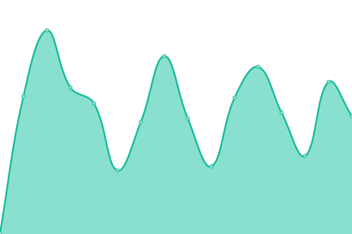
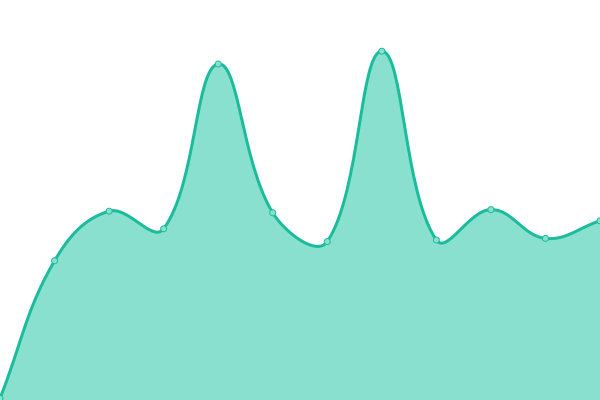
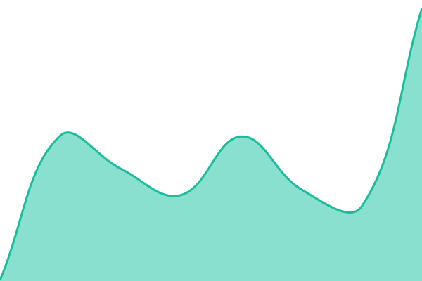

# [📈 Sophosic Platform Status](https://status.sophosic.ai)

Real-time status monitoring for [Sophosic Platform](https://sophosic.ai) services.

**🔗 View Live Status:** [status.sophosic.ai](https://status.sophosic.ai)

## 📊 Monitored Services

With [Upptime](https://upptime.js.org), you can get your own free status page, which is powered by GitHub Actions, Issues, and Pages.

<!--start: status pages-->
<!-- This summary is generated by Upptime (https://github.com/upptime/upptime) -->
<!-- Do not edit this manually, your changes will be overwritten -->
<!-- prettier-ignore -->
| URL | Status | History | Response Time | Uptime |
| --- | ------ | ------- | ------------- | ------ |
|  [Sophosic App](https://app.sophosic.ai/) | Down | [sophosic-app.yml](https://github.com/ezpzzz/status/commits/HEAD/history/sophosic-app.yml) | 

 127ms
     
 | 

<a href="https://status.sophosic.ai/history/sophosic-app">0.00%</a>
    

|  [API Backend](https://api.sophosic.ai/ready) | Down | [api-backend.yml](https://github.com/ezpzzz/status/commits/HEAD/history/api-backend.yml) | 

 582ms
     
 | 

<a href="https://status.sophosic.ai/history/api-backend">99.99%</a>
    

|  [API Health Check](https://api.sophosic.ai/api/v2/health/ping) | Down | [api-health-check.yml](https://github.com/ezpzzz/status/commits/HEAD/history/api-health-check.yml) | 

 161ms
     
 | 

<a href="https://status.sophosic.ai/history/api-health-check">100.00%</a>
    

|  [API Detailed Health](https://api.sophosic.ai/api/v2/health/) | Down | [api-detailed-health.yml](https://github.com/ezpzzz/status/commits/HEAD/history/api-detailed-health.yml) | 

 183ms
     
 | 

<a href="https://status.sophosic.ai/history/api-detailed-health">100.00%</a>
    

|  [Documentation](https://docs.sophosic.ai/) | Operational | [documentation.yml](https://github.com/ezpzzz/status/commits/HEAD/history/documentation.yml) | 

 568ms
     
 | 

<a href="https://status.sophosic.ai/history/documentation">100.00%</a>
    

|  [Marketing Site](https://sophosic.ai/) | Operational | [marketing-site.yml](https://github.com/ezpzzz/status/commits/HEAD/history/marketing-site.yml) | 

 229ms
     
 | 

<a href="https://status.sophosic.ai/history/marketing-site">100.00%</a>
    

<!--end: status pages-->

[**Visit our status website →**](https://status.sophosic.ai)

## 📄 License

- Code: [MIT](./LICENSE) © [Anand Chowdhary](https://anandchowdhary.com), supported by [Pabio](https://pabio.com)
- Data in the `./history` directory: [Open Database License](https://opendatacommons.org/licenses/odbl/1-0/)
